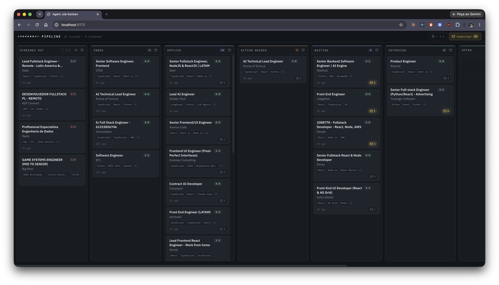

# agent-job-kanban

A self-updating job-application kanban board, run by Claude Code agents.

Three scheduled agents do the busywork: one scrapes LinkedIn for new postings that match your search, one scores every posting against your resume so poor fits screen themselves out, and one reads your Gmail and moves cards forward when recruiters reply. You just drag cards and show up to interviews.



## How it works

```
LinkedIn ──(scraper agent, 2x/day)──▶ ┌─────────────────┐
                                      │  Hono + SQLite   │ ◀──── React board
Gmail ────(tracker agent, 2x/day)──▶  │  API on :3001    │       on :5173
                                      └─────────────────┘
your resume ──(scorer agent, 2x/day)──────────▲
```

- **LinkedIn scraper** — browses your saved LinkedIn search in your own Chrome (via the Claude in Chrome extension), extracts each new posting's full description, and inserts it into the **Inbox** column. Skips duplicates and companies you've banned.
- **Job scorer** — scores every unscored job 1–5 against `profile/cv.md` + `profile/profile.yml` on a weighted rubric (CV match 35%, target-role fit 25%, comp 15%, culture 15%, red flags 10%). The **server** — never the agent — moves low scorers from Inbox to **Screened Out** based on a threshold you control from the UI.
- **Gmail tracker** — scans recent mail for application-related messages (read-only), attaches them to the matching card, and moves the card's status forward (interview invite → Interview, rejection → Rejected, …). Never moves cards backwards. Unmatched mail lands in a tray in the UI for manual linking.

The agents are plain-Markdown playbooks in [`agents/`](agents/) that scheduled Claude Code sessions follow verbatim. They talk to the API only — never the database — and fail closed: health check first, any server error aborts the run, and no data is ever written on a guess.

Everything is **single-user and local-only**: no auth, no cloud, one SQLite file.

## Stack

- **Backend**: [Bun](https://bun.sh) + [Hono](https://hono.dev) + [Drizzle ORM](https://orm.drizzle.team) over SQLite (`data/app.db`), validated with Zod.
- **Frontend**: React 19 (with the React Compiler) + Vite, [TanStack Router](https://tanstack.com/router) and [TanStack Query](https://tanstack.com/query), Tailwind CSS v4, drag-and-drop via [dnd-kit](https://dndkit.com).
- **Monorepo**: Bun workspaces (`apps/server`, `apps/web`).
- **Agents**: [Claude Code](https://claude.com/claude-code) Desktop app (local scheduled tasks + the Claude in Chrome extension + the Gmail connector).

## Getting started

### 1. Run the app

```bash
bun install
bun run dev
```

- server → http://localhost:3001
- web → http://localhost:5173

The SQLite file lives at `data/app.db` (gitignored, created on first run).

Or with Docker:

```bash
docker compose up -d --build
```

`data/app.db` is bind-mounted into the server container, so the containerized API shares the same database as the host-side agents. Don't run `bun run dev` and the Docker stack at the same time — they bind the same ports. Remember that container code is only updated on `--build`.

### 2. Onboard yourself

Open the repo in Claude Code and run:

```
/onboarding
```

The wizard asks for your resume and a short set of questions, then:

1. generates `profile/cv.md` and `profile/profile.yml` (both gitignored — they're personal),
2. sets **your** LinkedIn search URL in the scraper playbook,
3. rewrites the playbooks' absolute paths and Chrome profile for your machine,
4. installs the playbooks as Claude Desktop scheduled-task skills,
5. walks you through scheduling the three routines.

### 3. Schedule the routines

The agents must run as **local scheduled tasks in the Claude Code Desktop app** — cloud routines can't reach your Chrome or `localhost`. In the Desktop app: Routines → New task → **Local**, working directory = this repo, model Sonnet:

| Task | Time (local) | Prompt |
|---|---|---|
| LinkedIn scraper | 09:00 & 18:00 | `Read <repo>/agents/linkedin-scraper.md and follow it exactly.` |
| Job scorer | 09:15 & 18:15 | `Read <repo>/agents/job-scorer.md and follow it exactly.` |
| Gmail tracker | 09:30 & 18:30 | `Read <repo>/agents/gmail-tracker.md and follow it exactly.` |

The stagger matters: new jobs get scored (and screened out where warranted) before the tracker tries to match confirmation emails to them.

Run-time preconditions: Mac awake; Chrome open and logged into LinkedIn (scraper); Gmail MCP connector connected in the Desktop app (tracker, read-only). The scorer only needs the API and `profile/` populated. Docs: https://code.claude.com/docs/en/desktop-scheduled-tasks.md

### Run an agent on demand

Each agent is also a project skill, so you can trigger it any time from a Claude Code session in this repo — no need to wait for the schedule:

```
/linkedin-scraper    # check for new postings now
/job-scorer          # score whatever is unscored
/gmail-tracker       # process recent replies
```

The skills run the exact same playbooks the routines use.

## The board

| Column | Meaning |
|---|---|
| Screened Out | Scored below your threshold. Still visible and recoverable — not deleted. |
| Inbox | Newly scraped posting, nothing applied yet. |
| Applied | Application submitted, no reply needing action. |
| Action Needed | An email arrived that needs a response (assessment, screening call, question). |
| Waiting | Applied and waiting — nothing pending on your side. |
| Interview | Interview scheduled or in progress. |
| Offer | Offer received. |
| Rejected | Application rejected. |
| Archived | Out of the running but kept for history. Cards and whole columns can be archived. |

**Settings** (gear, top right): the screen-out threshold — moving it reconciles existing cards across the Inbox/Screened Out boundary in both directions — and the **banned companies** list. Ban a company from any card's detail sheet: its cards archive immediately and the scraper never inserts it again (the server also rejects banned companies as a backstop). Unban from Settings.

## API overview

Base URL: `http://localhost:3001`. Bodies are Zod-validated server-side; see `apps/server/src/routes/*.ts` for exact schemas.

| Method | Path | Purpose |
|---|---|---|
| GET | `/api/health` | Liveness check, `{ok: true}`. |
| GET | `/api/jobs` | Full job list with email counts. |
| GET | `/api/jobs/exists?linkedinJobId=` | Dedupe check before inserting a scraped job. |
| GET | `/api/jobs/search?company=&title=` | Case-insensitive partial match, used to link emails to jobs. |
| POST | `/api/jobs` | Create a job. Idempotent on `linkedinJobId`; returns `{banned: true}` without inserting if the company is banned. |
| PATCH | `/api/jobs/:id` | Update `status`, `sortOrder`, `score`, `scoreBreakdown`, `techTags`, or `description`. Setting `score` to `null` re-queues scoring. |
| POST | `/api/jobs/:id/score` | Submit a score. The server decides whether the job moves to `screened_out` (threshold setting). |
| DELETE | `/api/jobs/:id` | Delete a job. Its emails are tombstoned, not deleted, so the Gmail tracker's dedupe keeps working. |
| POST | `/api/jobs/:id/emails` | Attach an email to a job. Idempotent on `gmailMessageId`. |
| POST | `/api/emails` | Insert an unmatched email (idempotent). |
| GET | `/api/emails/unmatched` | Emails with no job, for the UI's unmatched tray. |
| PATCH | `/api/emails/:id` | Re-link an unmatched email to a job, mark seen, or dismiss. |
| GET | `/api/settings` | Current settings (`{screenOutThreshold}`). |
| PATCH | `/api/settings` | Update the threshold; reconciles existing scored jobs immediately. |
| GET | `/api/banned-companies` | List banned companies. |
| POST | `/api/banned-companies` | Ban a company (`{company}`); archives its existing cards. Case-insensitive, idempotent. |
| DELETE | `/api/banned-companies/:id` | Unban. Previously archived cards stay archived. |

Job `status` is one of: `screened_out`, `inbox`, `applied`, `action_needed`, `waiting`, `interview`, `offer`, `rejected`, `archived`. Email `classification` is one of: `confirmation`, `action_request`, `interview`, `rejection`, `offer`, `other`.

## The scoring profile

The scorer reads two gitignored files in `profile/`: `cv.md` (your resume as Markdown) and `profile.yml` (target roles/archetypes, compensation targets, location and visa status). `/onboarding` creates both; edit them any time — the scorer reads them fresh each run. If either is missing, the scorer logs the fact and stops rather than scoring blind. The full rubric lives in [`agents/job-scorer.md`](agents/job-scorer.md).

## Development

```bash
bun run dev      # server + web, watch mode
bun run server   # API only
bun run lint     # ESLint, both workspaces
bun run test     # server test suite (bun test)
```

Tests run against an in-memory SQLite database — they never touch `data/app.db`. If you edit an agent playbook, mirror the edit to its copy in `~/.claude/scheduled-tasks/<name>/SKILL.md`; the two must stay identical. See [`CLAUDE.md`](CLAUDE.md) for the architecture notes and invariants that keep the agents and server honest.
